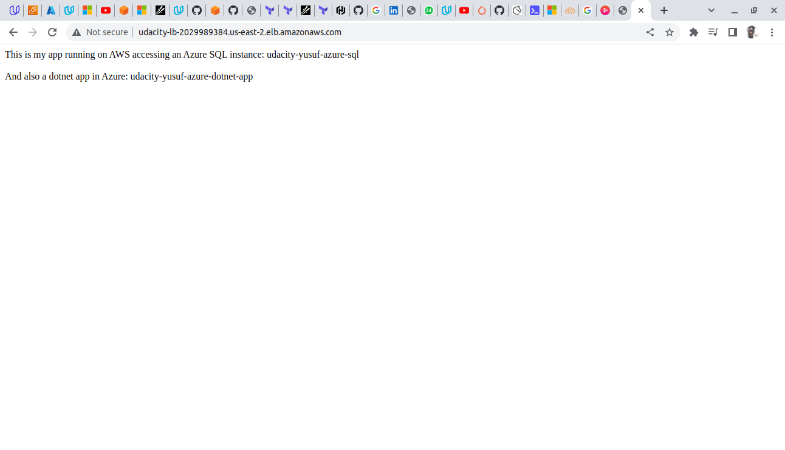

# A Multi-Cloud Application

Architecture Diagram - [multicloud.pdf](./multicloud.pdf)

## AWS DYNAMO DB
### Requirements
` Global availability  `
- Dynamo DB allows us to split the services equally providing high availability since it fulfils all requirements

` Pricing `
| Service | AWS | Azure | Choice |
| -------------- | :--------- | ----------: | :----------: |
| NoSQL Database with 150Gb storage |  $63.64 per month|  $60.86 per month| AWS Dynamo |
- Similar price point 

### Images
- Destroying terraform on aws 

- Destroying terraform on azure 

- App service render on azure 

- App service render on aws 

